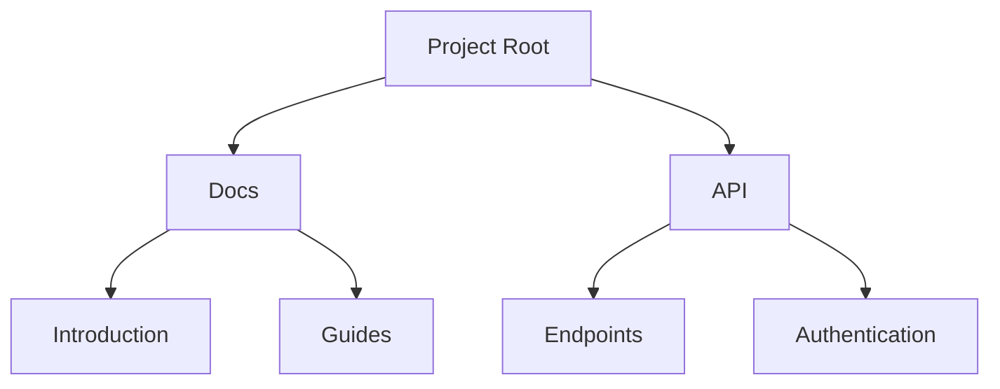

## Overview

mwP Сoub provides powerful tools to streamline your documentation workflow. You create, organize, collaborate, and maintain docs with ease. Key features include intuitive document editing, flexible project structures, real-time collaboration, and robust search with version history.

<Columns cols={2}>
  <Card title="Document Creation" icon="edit-3" href="#document-creation">
    Build rich documents using markdown and interactive components.
  </Card>
  <Card title="Project Structure" icon="folder" href="#project-structure">
    Organize content hierarchically with folders and pages.
  </Card>
</Columns>

<Columns cols={2}>
  @startuml
  <Card title="Collaboration" icon="users" href="#collaboration">
    Invite teams and share securely.
  </Card>
  <Card title="Search & Version Control" icon="search" href="#search-version">
    Find content fast and track changes over time.
  </Card>
</Columns>

## Document Creation and Editing

Create new documents directly from the dashboard. You support markdown, code blocks, and MDX components for interactive content.

<Steps>
  <Step title="Create Document" icon="plus">
    Click the `New Document` button in your project dashboard.
  </Step>
  <Step title="Edit Content" icon="edit">
    Use the visual editor or switch to markdown mode. Add headings, lists, and components like `<Callout>` for emphasis.
  </Step>
  <Step title="Preview and Publish" icon="eye">
    Preview changes live, then publish to make available to your team.
  </Step>
</Steps>

<CodeGroup tabs="Markdown,MDX">
  ```markdown
  ## Welcome

  This is your first document.

  - List item 1
  - List item 2
  ```
  ```mdx
  ## Welcome

  <Callout kind="info">
    This document uses MDX components.
  </Callout>

  1. First step
  2. Second step
  ```
</CodeGroup>

<Callout kind="tip">
  Use `{variable}` syntax in backticks for inline code examples to avoid parsing issues.
</Callout>

## Project Structure and Folders

Organize your documentation into a tree-like structure. Create folders to group related pages, making navigation intuitive.



Nest folders as deeply as needed. Drag and drop to reorder pages.

## Collaboration and Sharing Options

Invite team members with role-based permissions. Share public links or embed docs externally.

<Tabs>
  <Tab title="Team Invite" icon="mail">
    Go to project settings > Members. Enter emails and assign roles like `Editor` or `Viewer`.

    <ParamField path="userId" param-type="string" required="true">
      Unique user identifier.
    </ParamField>
    <ParamField path="role" param-type="string" required="false">
      Options: `admin`, `editor`, `viewer`.
    </ParamField>
  </Tab>
  <Tab title="Public Sharing" icon="globe">
    Toggle `Public Access` in sharing settings. Generate a shareable URL like `https://docs.mwpcloud.com/project/abc123`.
  </Tab>
</Tabs>

## Search and Version Control

Search across all documents with full-text indexing. View version history to revert changes.

<Expandable title="Advanced Search Filters" default-open="true">
  Filter by folder, date range, or author. Example query: `from:john status:published`.
</Expandable>

<ExpandableGroup>
  <Expandable title="View History">
    Click the history icon on any page. Compare diffs and restore previous versions.
  </Expandable>
  <Expandable title="Branching (Beta)">
    Create branches for experimental docs without affecting the main project.
  </Expandable>
</ExpandableGroup>

Master these features to build a comprehensive documentation hub for your projects.