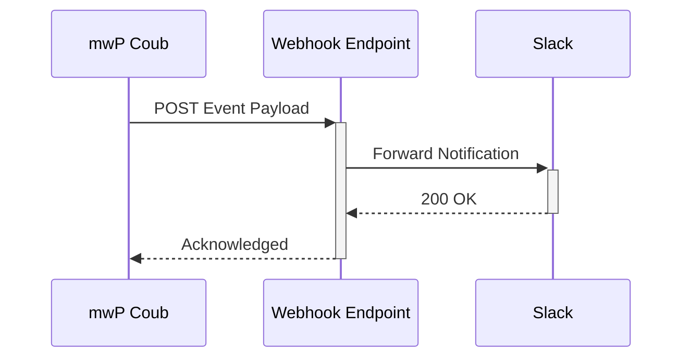

## Overview

mwP Сoub supports seamless integrations with popular third-party tools, enabling you to automate workflows, sync data, and extend functionality. Connect to services like Zapier for no-code automations, Slack for notifications, or GitHub for version control. You can also set up webhooks for real-time events, import/export documents in various formats, and use the API for custom extensions.

<Columns cols={3}>
  <Card title="Zapier" icon="zap" href="https://zapier.com/apps/mwpcoub/integrations" target="_blank">
    Build no-code automations with 5000+ apps.
  </Card>
  <Card title="Slack" icon="message-circle" href="https://api.mwpcoub.com/docs/slack" target="_blank">
    Send real-time notifications to your channels.
  </Card>
  <Card title="GitHub" icon="github" href="https://api.mwpcoub.com/docs/github" target="_blank">
    Sync repositories and automate deployments.
  </Card>
</Columns>

## Supported Integrations

mwP Сoub offers native integrations with productivity and development tools. Use the dashboard at `https://dashboard.example.com/integrations` to connect accounts.

| Integration | Category | Key Features |
|-------------|----------|--------------|
| Zapier     | Automation | Triggers on document updates, actions for exports |
| Slack      | Notifications | Event alerts, threaded replies |
| GitHub     | Version Control | Push/pull docs, webhook triggers |
| Google Drive | Storage | Sync folders, import Markdown |
| Airtable   | Database | Two-way data sync |

<Callout kind="tip">
  Start with Zapier for quick setups. Most integrations require only your `YOUR_API_KEY` from the dashboard.
</Callout>

## Set Up Webhooks for Automation

Webhooks let you receive real-time events from mwP Сoub, such as document updates or user actions. Configure them in your dashboard.

<Steps>
  <Step title="Create Webhook" icon="plus">
    Navigate to `https://dashboard.example.com/webhooks` and click "New Webhook".
  </Step>
  <Step title="Configure Events" icon="settings">
    Select events like `document.updated` or `user.created`.
  </Step>
  <Step title="Add Endpoint" icon="link">
    Enter your endpoint URL, e.g., `https://your-webhook-url.com/webhook`.
  </Step>
  <Step title="Test and Save" icon="check-circle">
    Send a test payload and verify receipt.
  </Step>
</Steps>

Here is a sample webhook payload:

<CodeGroup tabs="JSON">
  ```json
  {
    "event": "document.updated",
    "data": {
      "id": "doc_123",
      "title": "Project Plan",
      "updated_at": "2024-10-15T10:30:00Z"
    },
    "webhook_id": "wh_456"
  }
  ```
</CodeGroup>

## Import and Export Formats

Import existing docs or export to share externally. Supported formats include Markdown, PDF, and HTML.

<Tabs>
  <Tab title="Import" icon="upload">
    Upload files via dashboard or API.
    
    ```bash
    curl -X POST https://api.example.com/v1/import \
      -H "Authorization: Bearer YOUR_API_KEY" \
      -F "file=@project.md"
    ```
    
    <ParamField path="file" param-type="file" required="true">
      Document file (Markdown, DOCX).
    </ParamField>
  </Tab>
  <Tab title="Export" icon="download">
    Generate exports programmatically.
    
    <CodeGroup tabs="JavaScript,Python">
      ```javascript
      const response = await fetch('https://api.example.com/v1/export/doc_123?format=pdf', {
        headers: { Authorization: `Bearer ${YOUR_API_KEY}` }
      });
      const blob = await response.blob();
      ```
      ```python
      import requests
      response = requests.get(
        'https://api.example.com/v1/export/doc_123?format=pdf',
        headers={'Authorization': f'Bearer {YOUR_API_KEY}'}
      )
      with open('doc.pdf', 'wb') as f:
        f.write(response.content)
      ```
    </CodeGroup>
  </Tab>
</Tabs>

## API Access for Custom Extensions

Build custom integrations using the REST API at `https://api.example.com`. Authenticate with `YOUR_API_KEY`.

<ResponseField name="data" field-type="object" required="true">
  Response payload.
</ResponseField>

<ResponseField name="id" field-type="string">
  Unique resource ID.
</ResponseField>

<Callout kind="alert">
  Store `YOUR_API_KEY` securely. Rotate keys regularly via dashboard.
</Callout>

## Next Steps

Explore these integrations to supercharge your mwP Сoub workflow:

<Columns cols={2}>
  <Card title="Webhook Flows" icon="git-branch" href="#set-up-webhooks">
    Dive deeper into event handling.
  </Card>
  <Card title="API Reference" icon="code" href="https://docs.example.com/api">
    Full API documentation.
  </Card>
</Columns>

